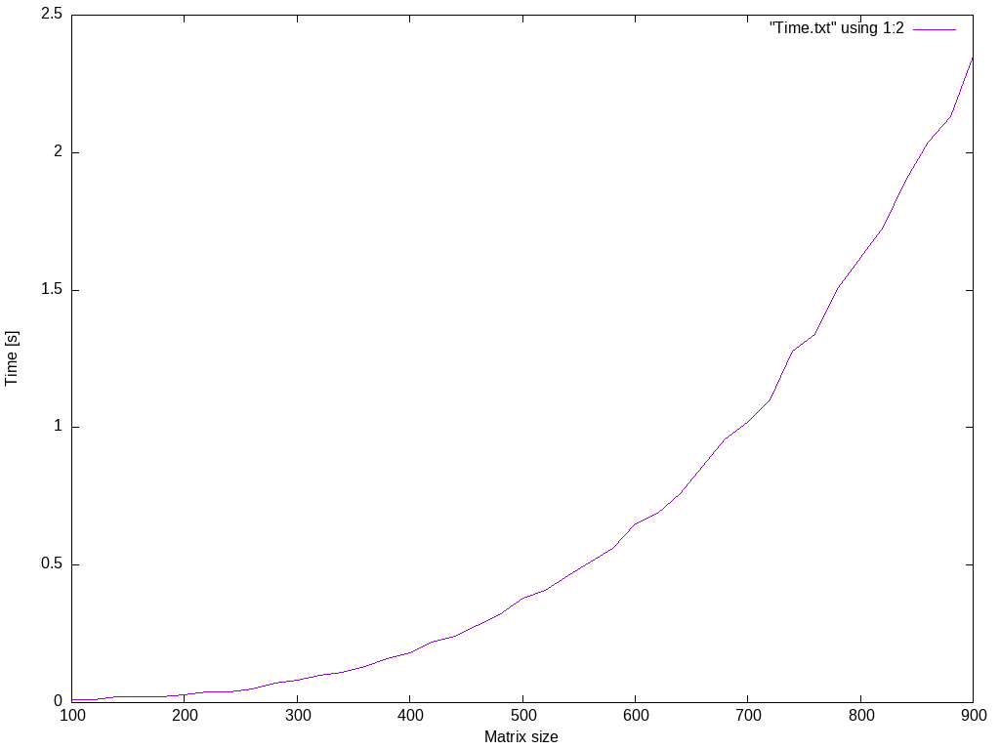

# Exam in practical programming and numerical methods

My student number is 202009792, therefore I have to do exercise 14 (92 % 26 = 14). This exercise is "Cholesky decomposition of a real symmetric positive-definite matrix".

# Project description

Cholesky decomposition of a real symmetric positive-definite matrix

For a real symmetric positive-definite matrix, A, the Cholesky decomposition, A=LLT (where L is lower-triangular), is more efficient than the LU-decomposition. Read the book and/or Wikipedia article [Cholesky-decomposition](https://en.wikipedia.org/wiki/Cholesky_decomposition).

Implement Cholesky decomposition of a real symmetric positive-definite matrix using [Cholesky-Banachiewicz or Cholesky-Crout algorithms](https://en.wikipedia.org/wiki/Cholesky_decomposition#The_Cholesky.E2.80.93Banachiewicz_and_Cholesky.E2.80.93Crout_algorithms).

Try implement also the corresponding linear equation solver, calculation of determinant, and calculation of the inverse matrix. 

# Implementation

I implemented the Cholesky algorithm to find the upper triangular matrix L of a real symmetric positive-definite matrix. From this, I implemented a linear equation solver. This was done by solving the equation Ly=b and then L^Tx=y. This then gives the vector x which solves the equation Ax=b.

Once the linear equation solver was implemented, I wrote a function that calculates the inverse matrix. The columns of the inverse matrix are determined by using the linear equation solver to solve the matrix A to each column of the inverse matrix.

The determinant could then be determined from the lower-triangular matrix L, where the determinant is then the product of the diagonal elements squared.

The following shows the time complexity of solving matrices of various sizes using the implemented linear equation solver

# Evaluation

As I have completed all the exercises in the exam project description and done some testing, I believe this exam project is at a 10/10.
